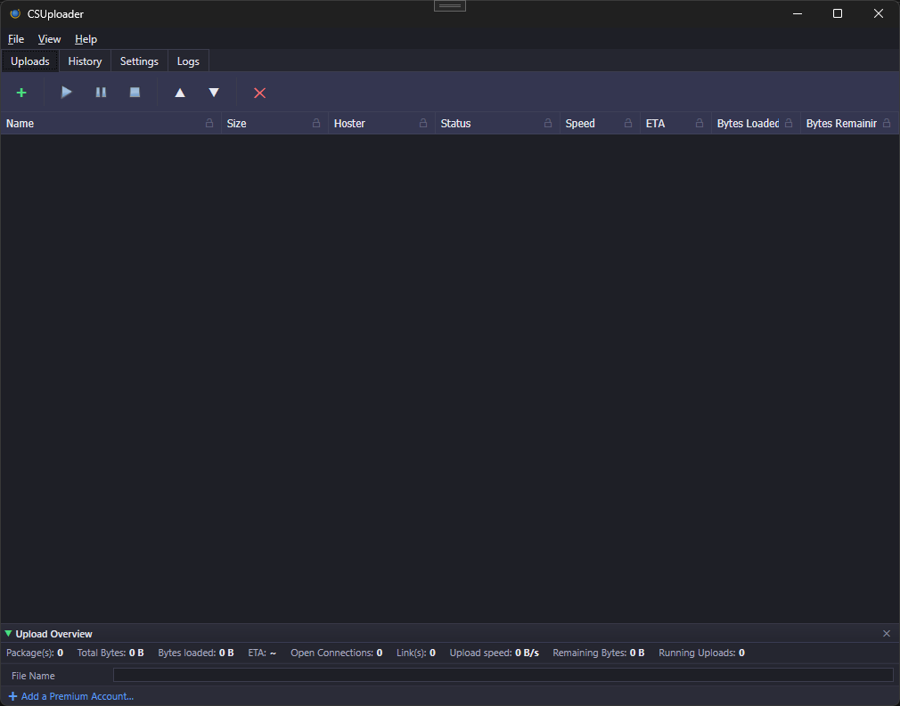

# CSUploader

CSUploader is a Windows desktop application for uploading files to file hosting services. It provides an upload wizard, a queue with real-time progress tracking, and history of past uploads.



## Features

- **Upload Wizard** — Guided flow for picking a directory, selecting files, choosing file hosters and accounts, and starting the upload.
- **Upload Queue** — Concurrent jobs with pause/resume, priority ordering, and a global speed limit.
- **File Hosters** — Pluggable architecture with twenty-seven hosters shipping: Alfafile, BRupload, catbox.moe, Ex-Load, FileBoom, File Garden, Filehoster.io, GigaPeta, gofile.io, Hexload, HitFile, Hxfile, IcerBox, Isracloud, KatFile, Keep2Share, MEGA, MediaFire, NitroFlare, Pixeldrain, Rapidgator, Storage.to, TezFiles, transfer.it, ufile.io, Upstore, and wormhole.app. Per-hoster account management with credential verification, plus anonymous (no-login) uploads for catbox.moe, GigaPeta, gofile.io, Hexload, HitFile, Storage.to, transfer.it, ufile.io, Upstore, and wormhole.app — three of them (transfer.it, MEGA, wormhole.app) end-to-end encrypted.
- **Connection Manager** — Optional proxy support with priority ordering, automatic rotation on retry, and connectivity testing.
- **Dark / Light Themes** — Choose your preferred theme; the choice persists between sessions.
- **System Tray** — Optional minimize-to-tray and close-to-tray with a first-run prompt to choose the close button's behaviour.
- **Auto-Update** — New releases are picked up in the background; install on demand via Help → Install Update.
- **Upload History** — Browsable log of completed uploads on the Uploaded tab with file-level URLs.

## Requirements

- Windows 10 (build 17763 / 1809+) or Windows 11
- [.NET 10 SDK](https://dotnet.microsoft.com/download/dotnet/10.0) for development; published builds are self-contained

## Build & Run

```bash
dotnet build
dotnet run --project src/CSUploader.csproj
dotnet test
```

## License

MIT — see [LICENSE](LICENSE).
